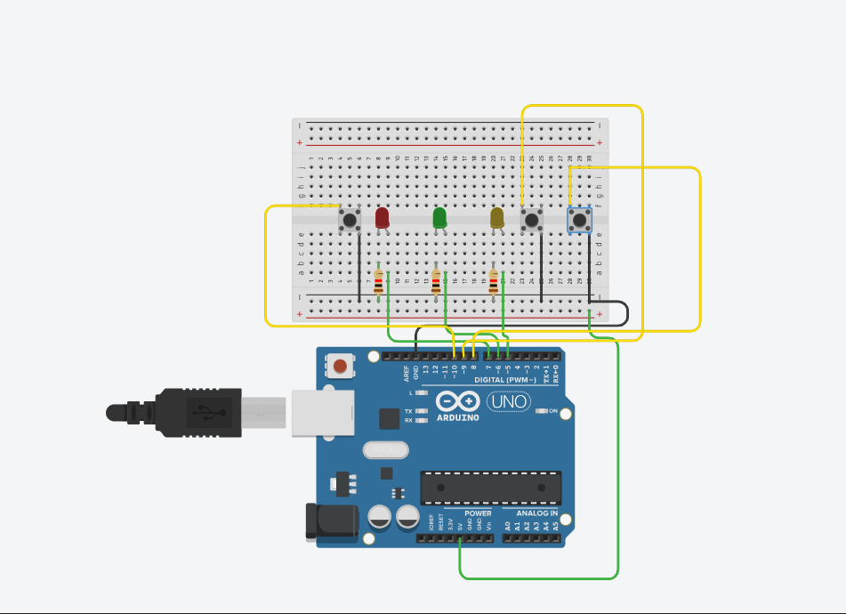
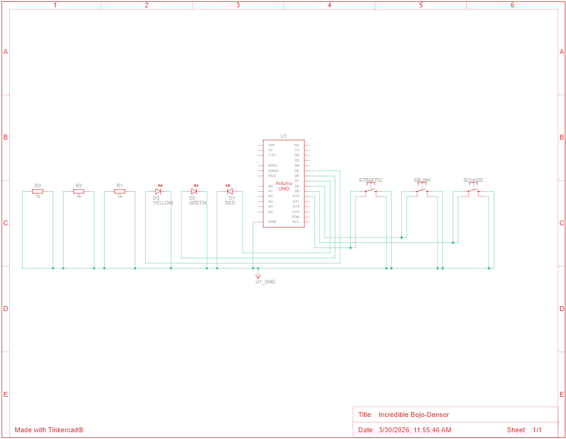

# 🚦 Arduino Traffic Light Controller (3 LEDs + 3 Buttons)

A simple and fun Arduino project that simulates a traffic light system and includes multiple LED modes controlled by buttons.

---

## 🧠 Features

* 🚦 **Traffic Light Mode**
  Simulates real traffic light behavior (Red → Yellow → Green)

* 🏃 **LED Chase Mode**
  LEDs turn on one after another in a running pattern

* 💥 **Blink All Mode**
  All LEDs blink together

* 🎮 **Button Control**
  Each mode is activated using a dedicated button

---

## 🧩 Components Required

* Arduino UNO (or compatible board)
* 3 LEDs (Red, Yellow, Green)
* 3 × 220Ω resistors
* 3 push buttons (4-pin)
* Breadboard
* Jumper wires

---

## 🔌 Pin Configuration

### LEDs

| LED Color | Arduino Pin |
| --------- | ----------- |
| Red       | 7           |
| Green     | 6           |
| Yellow    | 5           |

### Buttons

| Function       | Arduino Pin |
| -------------- | ----------- |
| Traffic Mode   | 10          |
| LED Chase Mode | 9           |
| Blink Mode     | 8           |

---

## ⚡ Wiring Guide

### LEDs

* Connect each LED **anode (long leg)** → resistor → Arduino pin
* Connect each LED **cathode (short leg)** → GND

### Buttons

* Place buttons across the breadboard gap
* One side → Arduino pin
* Other side → GND
* Use `INPUT_PULLUP` (no external resistor needed)

---

## 🎮 How It Works

* Press **Traffic Button** → activates traffic light sequence
* Press **Chase Button** → activates LED running effect
* Press **Blink Button** → activates blinking mode

👉 Only one mode runs at a time

---

---

## ⚠️ Notes

* Buttons use **INPUT_PULLUP**, so:

  * Pressed = LOW
  * Not pressed = HIGH

* Add **debouncing** if buttons behave inconsistently

---

---

## 🖼️ Circuit Diagram

---

## 🧾 Schematic

---

## 🚀 Future Improvements

* Add buzzer for sound alerts 🔊
* Add OLED display for status 📟
* Convert to WiFi control using ESP8266 🌐
* Replace LEDs with RGB module 🎨

---

## 👨‍💻 Author

Built by Elisee 💡
A simple step toward mastering embedded systems and IoT 🚀

---
